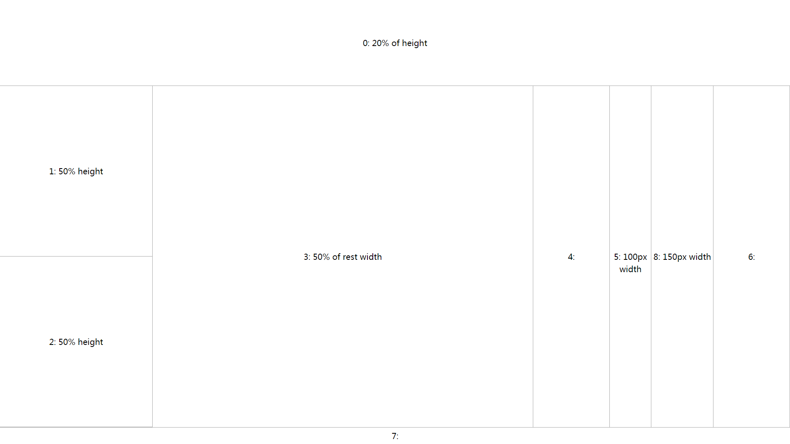

> This is under development

[](https://david-dm.org/valaxy/jquery-flex-layout)

# Introduction
[Flex-Layout](http://www.w3.org/TR/css3-flexbox/) is W3C standard    
This CommonJS module gives you a easily used function which you can config a json to create flex-layout.    


# Usage
```javascript
// You need all of these
require.config({
	paths  : {
		'algorithm-data-structure': 'node_modules/algorithm-data-structure/dest/',
		'underscore'              : 'node_modules/underscore/underscore-min',
		'jquery'                  : 'node_modules/jquery/dist/jquery.min',
		'jquery-ui'               : 'node_modules/jquery-ui/jquery-ui.min',
		'event-emitter'           : 'node_modules/eventEmitter/EventEmitter.min',
		'cjs'                     : 'node_modules/cjs/cjs',
		'amd-loader'              : 'node_modules/amd-loader/amd-loader',
	}
})

```

# Example
First, create a html(below is jade).

```jade
div.everything
	div.box0
    	h1 A
    div.box1
        h1 B
```
Second, config a json object to apply flex layout.

```javascript
	var treeLayout = require('tree-layout')
	var root = treeLayout.init({
		_schema: 'linear',
		direction: 'column',
		className: 'everything',
		views: [{
			_schema: 'simple',
			flex: 2,
			selector: '.box0'
		}, {
			_schema: 'simple',
			flex: 1,
			selector: '.box1'
		}]
	}) 
```

# API
## SimpleView
	{
	    _schema: 'simple',     // type string
	    flex: 1,               // or '10px', number:flex, string:width
	    selector: '.box',      // detach the dom
		className: 'my-simple' // add class to dom
	}

## LinearLayout
	{
		_schema: 'linear',      // type string
		flex: 2,	
		direction: 'column',    // or 'row'
		className: 'my-linear', 
		views: [...]            // view configs contained in dom
	}

- getViewAt
- appendView
- addViewAt
- removeViewAt

## CSS API
- `.linear[data-direction="row"]`
- `.linear[data-direction="column"]`
- `.linear`
- `.simple`
- `.view` all the LinearLayout and SimpleView
